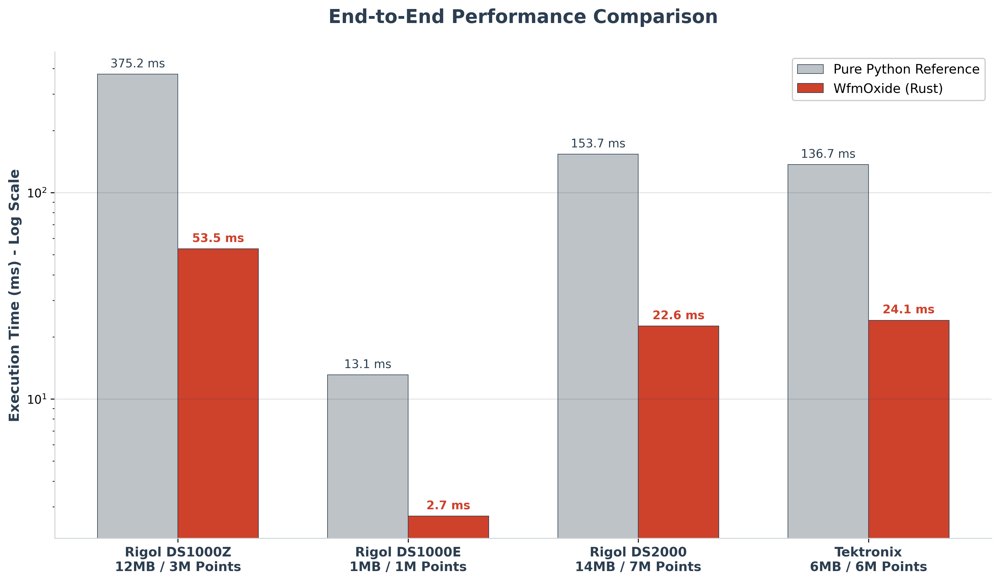

# WfmOxide

**WfmOxide** is a zero-copy parser for proprietary oscilloscope binary files (e.g., Rigol `.wfm`, Tektronix). Written in Rust with PyO3 bindings, it provides a high-performance backend alternative to pure-Python implementations like [RigolWFM](https://github.com/scottprahl/RigolWFM), optimized for deep-memory data pipelines.


*Figure 1: End-to-end execution latency across supported hardware families.*

## Architecture & Performance

* **Zero-Copy I/O:** Utilizes `memmap2` to map files directly into virtual memory. It avoids allocating memory for the raw binary payload, scaling efficiently across thousands of files.
* **Direct Array Construction:** De-interleaves ADC bytes and applies voltage conversion mathematics in a single Rust pass, writing directly to a contiguous NumPy `float32` array.
* **Parallel Execution:** Employs multi-threaded iteration during channel extraction via `rayon`, maximizing core utilization while the Python Global Interpreter Lock (GIL) is released.
* **Throughput:** For metadata and raw byte extraction, the pure Rust core executes in sub-millisecond timeframes (e.g., ~90µs for DS1000Z payloads), representing a multi-order-of-magnitude reduction in latency compared to standard interpreter overhead.

### Empirical Benchmarks

The following data details total end-to-end extraction latency, encompassing file I/O, metadata parsing, hardware-specific voltage scaling, and zero-copy transfer into the Python memory space. 

To establish a conservative baseline, tests were conducted on resource-constrained hardware (Intel Core i5-6300U, 2 Physical Cores, Arch Linux). Deployments utilizing modern multi-core workstations will observe proportionally higher parallel scaling.

| Oscilloscope Family | Payload Size | Data Points | Reference Python Parser | WfmOxide (Rust) | Relative Speedup |
| :--- | :--- | :--- | :--- | :--- | :--- |
| **Rigol DS1000Z** | 12.0 MB | 3.0 M | 375.2 ms | 53.5 ms | **7.0x** |
| **Rigol DS1000E** | 1.0 MB | 1.0 M | 13.1 ms | 2.7 ms | **4.8x** |
| **Rigol DS2000** | 14.0 MB | 7.0 M | 153.7 ms | 22.6 ms | **6.8x** |
| **Tektronix (WFM)** | 6.0 MB | 6.0 M | 136.7 ms | 24.1 ms | **5.6x** |

## Support Matrix

Binary formats vary heavily by manufacturer and firmware version. Support is implemented on a per-family basis.

| Manufacturer | Family | Status | Notes |
| :--- | :--- | :--- | :--- |
| **Rigol** | DS1000Z (e.g., DS1054Z) | Supported | Verified against reference datasets. |
| **Rigol** | DS1000E/D | Supported | Full channel parsing and verified voltage scaling. |
| **Rigol** | DS2000 | Supported | Verified with normal and interwoven/interleaved high-res captures. |
| **Tektronix**| TDS/DPO/MSO (WFM#001-003) | Supported | Full dynamic scaling, offsets, and endianness support. |

## Installation & Setup

WfmOxide is built from source using `maturin`.

### Standard Python Environment
```bash
git clone https://github.com/yourusername/WfmOxide.git
cd WfmOxide

python3 -m venv .venv
source .venv/bin/activate

pip install maturin numpy
maturin develop --release
```

### Reproducible Environment (Nix)
For environments utilizing the Nix package manager, a `shell.nix` is provided in the repository root to lock the exact Rust toolchain and Python dependencies required for compilation.

```bash
# Enter the isolated build environment
nix-shell 

# Build the Rust extension
maturin develop --release
```

## Python API

The Python interface is minimal and returns standard NumPy arrays.

```python
import numpy as np
from wfm_oxide import WfmOxide

# Memory-map the file
wfm = WfmOxide("DS1054Z-Capture.wfm")

print(f"Model: {wfm.model}")
print(f"Firmware: {wfm.firmware}")

# Extract channel data (Allocates NumPy array and applies Volts/Div conversion)
try:
    ch1_volts = wfm.get_channel_data(1) 
    print(f"CH1 Points: {len(ch1_volts)}")
    print(f"CH1 Max Voltage: {np.max(ch1_volts)} V")
except ValueError as e:
    # Handles cases where a channel was disabled during capture
    print(f"Error: {e}") 
```

## Extending Device Support

The architecture is modular to allow for the rapid addition of new oscilloscope models. To contribute support for a new device:

1.  **Define the Header:** Map the byte layout using the reference `.ksy` files in the `RigolWFM` repository. Implement the equivalent Rust struct in `src/structs.rs` using `binrw`.
2.  **Update Detection:** Register the model's magic bytes or header string in the `WfmFile::open` matcher within `src/mmap.rs`.
3.  **Implement Parser Logic:** Add a model-specific parsing routine (e.g., `get_channel_data_2000`) to `src/parser.rs`. This must handle the specific byte-interleaving and mathematical offsets for the target hardware.
4.  **Route the API:** Update the `match` statement in `src/lib.rs` to expose the new parser to the Python runtime.

## License & Acknowledgements

WfmOxide is released under the **MIT License**.

This project relies on the extensive reverse-engineering documentation compiled by the open-source community. The binary format specifications, memory offsets, and mathematical models used to build the Rust structs are ported from the [RigolWFM](https://github.com/scottprahl/RigolWFM) project.

*RigolWFM License (BSD 3-Clause):*
*Copyright (c) 2020-23, Scott Prahl. All rights reserved.*
