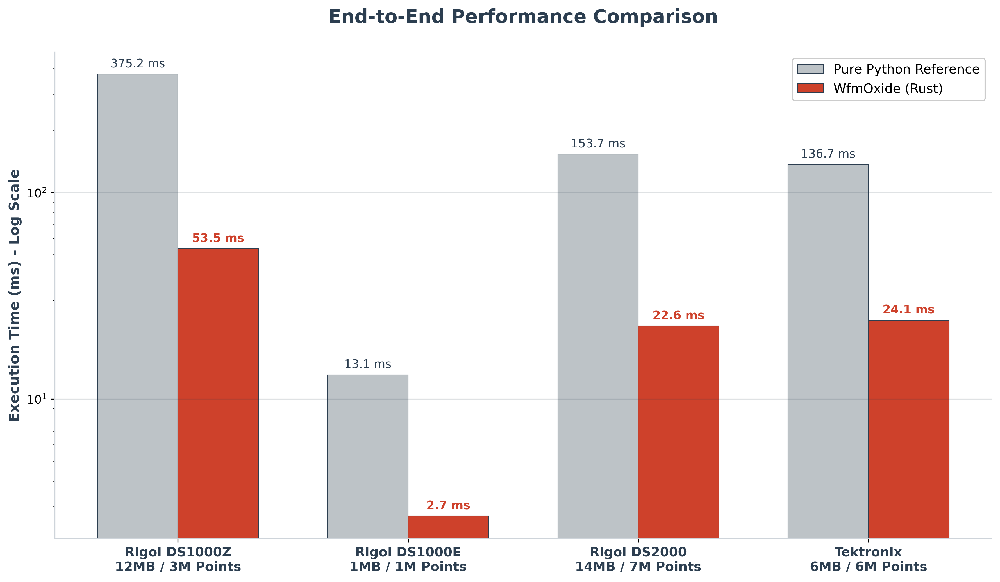

# WfmOxide

[](https://pypi.org/project/wfm-oxide/)
[](https://opensource.org/licenses/MIT)
[](https://github.com/SGavrl/WfmOxide/actions)

**WfmOxide** is a zero-copy parser for proprietary oscilloscope binary files (e.g., Rigol `.wfm`, Tektronix). Written in Rust with PyO3 bindings, it provides a high-performance backend alternative to pure-Python implementations like [RigolWFM](https://github.com/scottprahl/RigolWFM), optimized for deep-memory data pipelines.


*Figure 1: End-to-end execution latency across supported hardware families.*

## Architecture & Performance

* **Zero-Copy I/O:** Utilizes `memmap2` to map files directly into virtual memory. It avoids allocating memory for the raw binary payload, scaling efficiently across thousands of files.
* **Direct Array Construction:** De-interleaves ADC bytes and applies voltage conversion mathematics in a single Rust pass, writing directly to a contiguous NumPy `float32` array.
* **Parallel Execution:** Employs multi-threaded iteration during channel extraction via `rayon`, maximizing core utilization while the Python Global Interpreter Lock (GIL) is released.
* **Throughput:** For metadata and raw byte extraction, the pure Rust core executes in sub-millisecond timeframes (e.g., ~90µs for DS1000Z payloads), representing a multi-order-of-magnitude reduction in latency compared to standard interpreter overhead.

### Empirical Benchmarks

The following data details total end-to-end extraction latency, encompassing file I/O, metadata parsing, hardware-specific voltage scaling, and zero-copy transfer into the Python memory space. 

To establish a conservative baseline, tests were conducted on resource-constrained hardware (Intel Core i5-6300U, 2 Physical Cores, Arch Linux). Deployments utilizing modern multi-core workstations will observe proportionally higher parallel scaling.

| Oscilloscope Family | Payload Size | Data Points | Reference Python Parser | WfmOxide (Rust) | Relative Speedup |
| :--- | :--- | :--- | :--- | :--- | :--- |
| **Rigol DS1000Z** | 12.0 MB | 3.0 M | 375.2 ms | 53.5 ms | **7.0x** |
| **Rigol DS1000E** | 1.0 MB | 1.0 M | 13.1 ms | 2.7 ms | **4.8x** |
| **Rigol DS2000** | 14.0 MB | 7.0 M | 153.7 ms | 22.6 ms | **6.8x** |
| **Tektronix (WFM)** | 6.0 MB | 6.0 M | 136.7 ms | 24.1 ms | **5.6x** |

## Support Matrix

Binary formats vary heavily by manufacturer and firmware version. Support is implemented on a per-family basis. The "Time axis" column tracks whether `WfmFile::time_axis()` (and the Python `sample_rate` / `x_origin` / `x_increment` / `get_time_axis()` accessors) returns a value for that family.

| Manufacturer | Family | Decode | Time axis | Per-channel metadata |
| :--- | :--- | :--- | :--- | :--- |
| **Rigol** | DS1000Z (e.g., DS1054Z) | ✓ | ✓ | scale, offset, coupling, probe, inverted |
| **Rigol** | DS1000E/D | ✓ | – | scale, offset, probe, inverted |
| **Rigol** | DS2000 | ✓ | ✓ | scale, offset, coupling, probe, inverted |
| **Rigol** | DS4000 | ✓ | ✓ (origin approximate) | scale, offset, coupling, probe, inverted |
| **Rigol** | DHO800 / DHO1000 (12-bit, ZLib metadata) | ✓ | ✓ | scale, offset |
| **Tektronix** | TDS/DPO/MSO (WFM#001-003) | ✓ | – | scale, offset |
| **Tektronix** | TDS 210, TDS 1000, TPS 2024 (ISF) | ✓ | ✓ | scale, offset |
| **Keysight / Agilent** | InfiniiVision `.bin` (DSO-X, MSO-X) — normal float + u8 logic buffers | ✓ | ✓ | – (data is pre-scaled) |
| **Siglent** | SDS1xx4X-E series `.bin` (heuristic detection — no magic bytes) | ✓ | ✓ | scale, offset |
| **Teledyne LeCroy** | `.trc` WAVEDESC (LECROY_2_3 template — Wave*, HDO, DDA, LC) | ✓ | ✓ | scale, offset |

## Installation & Setup

WfmOxide is distributed as pre-compiled wheels via PyPI. For standard usage, no local Rust toolchain is required.

### Standard Installation (Recommended)
```bash
pip install wfm-oxide
```

### Building from Source
For development purposes or deployment on unsupported architectures, WfmOxide can be compiled directly from source using `maturin`.

```bash
git clone https://github.com/SGavrl/WfmOxide.git
cd WfmOxide

python3 -m venv .venv
source .venv/bin/activate

pip install maturin numpy
maturin develop --release
```

### Reproducible Environment (Nix)
For environments utilizing the Nix package manager, a `shell.nix` is provided in the repository root to lock the exact Rust toolchain and Python dependencies required for compilation.

```bash
# Enter the isolated build environment
nix-shell 

# Build the Rust extension
maturin develop --release
```

## Python API

The Python interface returns standard NumPy arrays and exposes both the voltage data and the surrounding capture metadata.

```python
import numpy as np
from wfm_oxide import WfmOxide

# Memory-map the file
wfm = WfmOxide("DS1054Z-Capture.wfm")

print(f"Model: {wfm.model}")
print(f"Firmware: {wfm.firmware}")
print(f"Enabled Channels: {wfm.enabled_channels}")

# --- Voltage data --------------------------------------------------
# Whole channel:
ch1_volts = wfm.get_channel_data(1)

# Or a slice (useful on deep-memory captures):
ch1_slice = wfm.get_channel_data(1, start=5000, length=10000)

# All channels at once. Disabled channels come back as None.
all_channels = wfm.get_all_channels()

# --- Time axis -----------------------------------------------------
# Returns None for formats that do not expose a time axis (DS1000E, Tek WFM).
print(f"Sample rate: {wfm.sample_rate} Hz")
print(f"x_origin: {wfm.x_origin} s, x_increment: {wfm.x_increment} s")

times = wfm.get_time_axis()  # NumPy float64, same length as channel data
times_slice = wfm.get_time_axis(start=5000, length=10000)

# --- Per-channel acquisition settings -----------------------------
print(wfm.channel_metadata(1))
# {'channel': 1, 'vertical_scale': 1.0, 'vertical_offset': -0.5,
#  'inverted': False, 'coupling': 'DC', 'probe_ratio': 10.0}
```

Properties and methods that may return `None` do so when the underlying format does not record that information; never as a soft error.

## Command-Line Interface

WfmOxide also ships a `wfm-oxide` binary in the `crates/wfm_oxide_cli` crate for shell pipelines and one-off conversions, with no Python dependency.

```bash
# Build the CLI (release):
cargo build --release -p wfm_oxide_cli

# Or install on PATH:
cargo install --path crates/wfm_oxide_cli
```

### `info` — capture metadata

```text
$ wfm-oxide info DS1054Z-Capture.wfm
File:     DS1054Z-Capture.wfm
Model:    DS1104Z
Firmware: 00.04.04.SP3
Channels: 2 enabled (CH1, CH2)
Sample rate: 25.0000 MSa/s
Sample step: 40.0000 ns
Capture:     2.4102 ms (60256 samples)
Time origin: -1.2051 ms
  CH1: 60256 samples, 1.0000 V/div, offset -500.0000 mV, coupling DC, probe 10x
  CH2: 60256 samples, 1.0000 V/div, offset -1.4600 V, coupling DC, probe 10x
```

`info` reads only the file header — sub-millisecond even on multi-million-sample captures. Pass `--json` to emit a machine-readable summary suitable for piping into `jq` or downstream tooling.

### `convert` — CSV / NPY export

```bash
# Single file → time-stamped CSV (one column per enabled channel)
wfm-oxide convert capture.wfm -o capture.csv

# Single channel → 1-D NPY
wfm-oxide convert capture.wfm -o ch1.npy --channel 1

# All channels → structured NPY (np.load(...)['time'], np.load(...)['CH1'], ...)
wfm-oxide convert capture.wfm -o capture.npy

# Slice a region without decoding the rest
wfm-oxide convert capture.wfm -o slice.csv --start 1000 --length 50000

# Batch: convert many captures into a directory
wfm-oxide convert *.wfm --out-dir converted/ --format csv
```

By default `convert` writes a leading `time` column (CSV) or a structured `('time', 'CH1', ...)` dtype (NPY) when the format exposes a time axis. Pass `--no-time` to omit it.

## Repository Layout

The crate is organised as a Cargo workspace so the CLI's dependencies (clap, serde, ...) do not leak into the Python wheel.

```
WfmOxide/
├── crates/
│   ├── wfm_oxide/          # Rust library (cdylib + rlib); feeds the Python wheel via maturin
│   │   └── src/            # mmap.rs, parser.rs, sample.rs, dho.rs, keysight.rs, lecroy.rs, siglent.rs, structs.rs, lib.rs
│   └── wfm_oxide_cli/      # `wfm-oxide` binary, depends on wfm_oxide as a path dependency
├── python/wfm_oxide/       # Python wrapper around the compiled extension
├── tests/                  # pytest suite, validated against RigolWFM as the reference
└── test_data/              # sample captures used by the test suite
```

## Extending Device Support

The architecture is modular to allow for the rapid addition of new oscilloscope models. To contribute support for a new device:

1.  **Define the Header:** Map the byte layout using the reference `.ksy` files in the `RigolWFM` repository. Implement the equivalent Rust struct in `crates/wfm_oxide/src/structs.rs` using `binrw` (or — for formats that need runtime work like ZLib decompression — a dedicated module such as `dho.rs`).
2.  **Update Detection:** Register the model's magic bytes or header string in the `WfmFile::open` matcher within `crates/wfm_oxide/src/mmap.rs`.
3.  **Implement Parser Logic:** Add a model-specific parsing routine (e.g., `get_channel_data_2000`) to `crates/wfm_oxide/src/parser.rs`. The shared `Affine` + `SampleType` machinery in `sample.rs` handles the inner byte-to-volts loop for variable bit-depth ADCs, so each new format only needs to derive the per-channel transform.
4.  **Route the API:** Add the new variant to the `WfmHeader` enum and extend the dispatch in `WfmFile::extract_channel`, `time_axis`, `channel_metadata`, and `channel_sample_count`. Re-exports in `crates/wfm_oxide/src/lib.rs` flow through to both the Python bindings and the CLI without further work.

## License & Acknowledgements

WfmOxide is released under the **MIT License**.

This project relies on the extensive reverse-engineering documentation compiled by the open-source community. The binary format specifications, memory offsets, and mathematical models used to build the Rust structs are ported from the [RigolWFM](https://github.com/scottprahl/RigolWFM) project.

*RigolWFM License (BSD 3-Clause):*
*Copyright (c) 2020-23, Scott Prahl. All rights reserved.*
